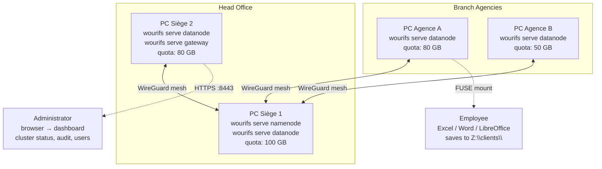

# WouriFS

**A distributed filesystem that makes every branch workstation part of the same drive — no server room, no IT team, no new software to learn.**

---

## What is WouriFS?

Small microfinance institutions in Cameroon manage their data in silos: each branch keeps its own Excel files, local databases, and paper records. The head office has no real-time visibility, and branch personnel can modify ledgers without detection — the structural condition behind the FIFFA (2012) and COMECI (2016) collapses.

WouriFS solves this at the **filesystem layer**. Every branch workstation mounts a shared directory via FUSE. Employees save files the way they always have. The difference: files are not stored locally — they are distributed, replicated, encrypted, and every write is cryptographically recorded in an immutable audit log.

No web app to learn. No workflow to change. The filesystem itself is the platform.

---

## Architecture



**How it works:**

- **Namenode** (Raft x3 planned): metadata server — file paths, chunk locations, namespace isolation
- **Datanode** (RF=3, quorum write W≥2): stores encrypted chunks on every participating workstation
- **FUSE client**: POSIX mount — `cat`, `echo`, `ls`, `mkdir` work normally. Existing tools just work.
- **Gateway**: admin dashboard only — cluster health, user provisioning, audit inspection
- **Audit log**: every write generates a timestamped, attributable, SHA-256 Merkle-chained entry. Immutable. Verifiable.
- **wouri-watchd**: anomaly detection — out-of-hours writes, velocity spikes, dormant user activity
- **Keyring**: AES-256-GCM at-rest encryption per chunk. Master key sealed with Shamir's Secret Sharing (k=2, n=2)

---

## Why WouriFS?

| Problem | WouriFS Solution |
|---|---|
| Data silos per branch | Single distributed volume, all branches share the same filesystem |
| Ledger manipulation | Every write is cryptographically audited — immutable, verifiable |
| No IT staff | One binary per workstation. `wourifs init` → `wourifs serve datanode`. Done. |
| No server room | Every workstation contributes storage. RF=3 across office PCs. |
| Expensive core banking software | Excel is the UI. WouriFS is the storage layer underneath. |

---

## Quick Start

### Prerequisites

- Linux (Ubuntu 22.04+), `libfuse3-dev`, Go 1.21+
- 2+ machines on the same LAN (or Tailscale for WAN)

### Install

```bash
git clone https://github.com/MiltonJ23/WouriFS.git
cd WouriFS
go build ./cmd/wourifs/
```

### Deploy (3 machines, 5 minutes)

```bash
# --- Machine 1 (Head Office) ---
./wourifs init
# Node ID: siege-1, Roles: namenode,datanode, Quota: 100
./wourifs serve namenode --dev-no-auth &
./wourifs serve datanode &

# --- Machine 2 (Branch A) ---
./wourifs init
# Node ID: agence-a, Roles: datanode, Quota: 80
./wourifs serve datanode &

# --- Machine 3 (Anywhere — mount the drive) ---
sudo ./wourifs mount -n <namenode-ip>:9000 /mnt/wourifs

# --- Use it ---
echo "Solde client 001: 50000 CFA" > /mnt/wourifs/agence-a/registre.csv
cat /mnt/wourifs/agence-a/registre.csv
ls -R /mnt/wourifs/
```

### CLI Reference

```
wourifs init                  Interactive first-time setup
wourifs serve namenode        Start metadata server + Raft consensus
wourifs serve datanode        Start chunk storage node
wourifs mount /mnt/wourifs    Mount as local directory via FUSE
wourifs status                Cluster health overview
wourifs provision split       Generate Shamir shares (dual-control)
wourifs provision combine     Reconstruct master key from shares
wourifs audit log             View append-only audit entries
wourifs audit verify          Check Merkle chain integrity
```

---

## Development

### Build

```bash
go build ./cmd/wourifs/      # unified CLI
go build ./cmd/fuse/         # standalone FUSE binary
go build ./cmd/namenode/     # standalone Namenode binary
go build ./cmd/datanode/     # standalone Datanode binary
```

### Test

```bash
go test ./internal/... ./pkg/... -cover
```

Current coverage: **all packages ≥ 82%** (14 packages, 15 test files).

### Observability

```
# Prometheus metrics (on every node)
curl http://localhost:9102/metrics

# Grafana dashboard
# Import configs/grafana/wourifs-dashboard.json
```

---

## Project Structure

```
cmd/
  wourifs/         Unified Cobra CLI (serve, mount, init, provision, status, audit)
  fuse/            Standalone FUSE mount binary
  namenode/        Standalone Namenode binary
  datanode/        Standalone Datanode binary
  provision/       Shamir share split/combine tool
  bench/           gRPC I/O benchmark
internal/
  namenode/        Metadata store, WAL, Raft FSM, gRPC server
  datanode/        Chunk store, gRPC server, replication
  audit/           Merkle-chained append-only audit log
  keyring/         AES-256-GCM encryption with HKDF key derivation
  watchd/          Behavioural anomaly detection engine
  observability/   Prometheus metrics, W3C Trace Context tracing, slog logging
  shamir/          Shamir Secret Sharing over GF(2^256-189)
  provision/       Dual-control provisioning server + DB
  transport/       TLS 1.3 config, gRPC auth interceptor
  auth/jwt/        JWT RS256 token manager
pkg/crypto/bcrypt/ Bcrypt password hashing (cost ≥ 12)
api/proto/v1/      Protocol Buffer service definitions
configs/           wourifs.yaml example, Grafana dashboard JSON
```

---

## License

MIT © 2026 ZINGUI Fred Mike — ICT University, BSc Computer Science Final Year Project
