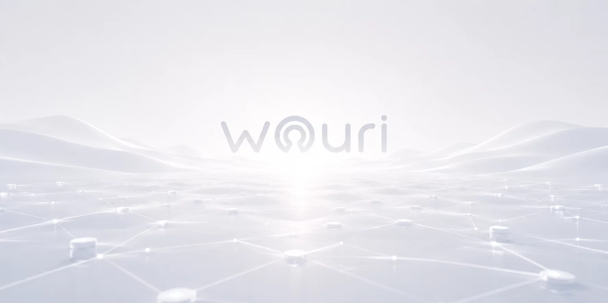
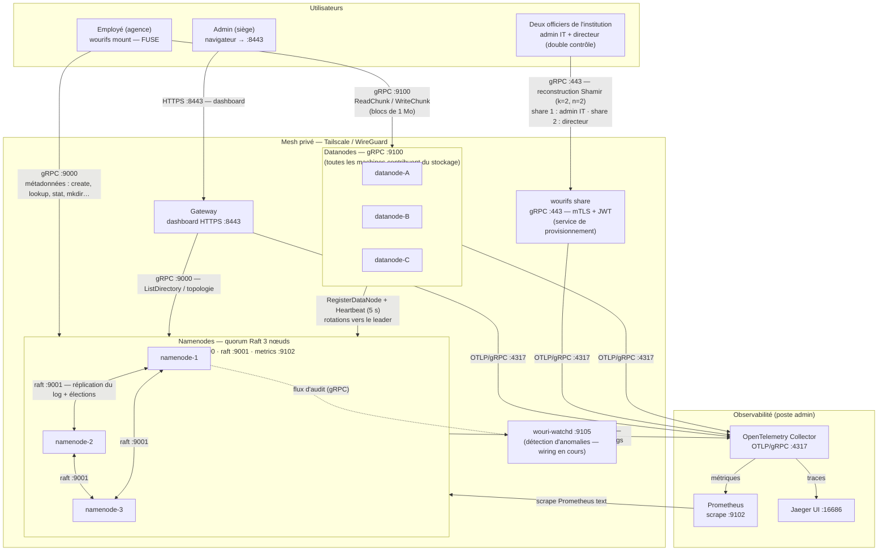

<p align="center">
  <picture>
    <source srcset="assets/wouri.webp" type="image/webp">
    
  </picture>
</p>

# WouriFS

**An auditable distributed filesystem that blends into existing workflows with minimal friction — every write leaves a cryptographically verifiable trace.**

---

## Description

WouriFS is a distributed, replicated, cryptographically-auditable filesystem built in Go, designed for Cameroonian microfinance institutions (Category 1 & 2 EMFs) that operate without dedicated IT staff or server infrastructure.

### The Problem

Small microfinance institutions in Cameroon manage their financial data in isolated silos — one per branch. Each agency maintains its own spreadsheets, local databases, or paper ledgers. There is no centralized storage, no real-time reconciliation between branches, and no technical mechanism preventing a branch manager from modifying records on their local machine without the head office ever knowing. This structural condition enabled the undetected ledger manipulation behind the collapse of FIFFA (2012) and COMECI (2016—2018).

### The Solution

WouriFS operates at the filesystem layer. Every branch workstation mounts a shared directory via FUSE. Employees save Excel spreadsheets, accounting files, and client records the way they always have. The difference: nothing is stored locally. Every file lives in a distributed cluster replicated across all branch workstations, encrypted at rest, and every write is timestamped, attributable, and cryptographically verifiable in an immutable audit log.

**The employee sees a folder. The head office sees everything in real time. The audit trail sees everything, forever.**

---

## Architecture

Vue processus : chaque composant est un processus `wourifs`, connecté par gRPC, Raft et OTLP.



**Connecteurs** : gRPC `:9000` (métadonnées), gRPC `:9100` (chunks), Raft `:9001` (consensus), OTLP/gRPC `:4317` (télémétrie), HTTP `:8443` (dashboard), HTTP `:9102` (Prometheus). Le FUSE lit la topologie des chunks auprès du namenode puis stream les blocs directement depuis les datanodes (rf=3, quorum d'écriture W≥2).

> À savoir : le **join Raft multi-nœud** (`AddVoter`) n'est pas encore exposé par la CLI — le déploiement réel actuel démarre avec 1 namenode ; le diagramme montre la cible à 3 nœuds.

### Key Components

| Component | Role |
|---|---|
| **Namenode** | Metadata server — file-to-chunk mapping, namespace isolation, WAL persistence, Raft consensus (HA planned) |
| **Datanode** | Chunk storage — flat binary files, RF=3 replication, quorum writes (W≥2), AES-256-GCM encryption at rest |
| **FUSE Client** | POSIX filesystem mount — `cat`, `ls`, `mkdir` work transparently. Zero training for employees. |
| **Gateway** | Admin dashboard — cluster health, user provisioning, dual-control USB key workflow, audit inspection |
| **Audit Log** | SHA-256 Merkle-chained append-only journal. Every write recorded. Immutable. Verifiable on demand. |
| **wouri-watchd** | Anomaly detection daemon — out-of-hours writes, velocity spikes, dormant user activity, Raft leadership changes |
| **Keyring** | AES-256-GCM per-chunk encryption. Master key sealed with Shamir's Secret Sharing (k=2, n=2) — two officers required to unseal. |

### No Servers Required

Every office workstation runs `wourifs serve datanode` and contributes a configurable disk quota. One or two workstations at the head office additionally run `wourifs serve namenode`. Total cluster capacity = sum of all workstation quotas. Replication factor 3 means data survives any single machine failure.

---

## Prerequisites & Installation

### Requirements

- Linux (Ubuntu 22.04 LTS+), x86-64
- Go 1.21+
- `libfuse3-dev`
- 2+ machines on the same LAN (or Tailscale for multi-site WAN)

### Build

```bash
git clone https://github.com/MiltonJ23/WouriFS.git
cd WouriFS
sudo apt install -y golang-go libfuse3-dev
go build ./cmd/wourifs/
```

One binary. That's it.

---

## Usage

### First-Time Setup

```bash
./wourifs init
# Cluster name: emf-yaounde
# Node ID: siege-1
# Roles: namenode,datanode
# Disk quota (GB): 100
# Data directory: /var/lib/wourifs/siege-1
# Network mode: tailscale
```

Produces `/etc/wourifs/wourifs.yaml`. Copy it to every machine, change only `node.id`.

### Start the Cluster

```bash
# Head Office — namenode + datanode
./wourifs serve namenode --dev-no-auth &
./wourifs serve datanode &

# Branch Agency — datanode only
./wourifs serve datanode &
```

### Mount the Drive

```bash
sudo ./wourifs mount -n <namenode-ip>:9000 /mnt/wourifs
```

### Use It

```bash
# Branch employee — normal file operations
echo "ID,Nom,Solde" > /mnt/wourifs/agence-a/registre.csv
echo "001,Dupont,50000" >> /mnt/wourifs/agence-a/registre.csv
cat /mnt/wourifs/agence-a/registre.csv
mkdir /mnt/wourifs/agence-a/clients
ls -R /mnt/wourifs/
```

### Admin Operations

```bash
./wourifs status                      # cluster health
./wourifs provision split             # generate Shamir shares
./wourifs provision combine           # reconstruct master key
./wourifs audit log                   # view audit entries
./wourifs audit verify                # check Merkle chain integrity
curl http://localhost:9102/metrics    # Prometheus metrics
```

### CLI Reference

```
wourifs init                  First-time interactive setup
wourifs serve namenode        Start Namenode metadata server
wourifs serve datanode        Start Datanode chunk storage
wourifs mount /mnt/wourifs    Mount distributed filesystem via FUSE
wourifs status                Cluster health overview
wourifs provision split       Generate Shamir shares (k=2, n=2)
wourifs provision combine     Reconstruct master secret from shares
wourifs audit log             Query append-only audit log
wourifs audit verify          Verify Merkle chain integrity
```

---

## Contributing

This project is a Bachelor's Final Year Dissertation at The ICT University. External contributions are not accepted during the evaluation period. For academic inquiries, contact the author.

---

## Comparative Analysis — Why Not an Existing Solution?

The storage integrity problem addressed by WouriFS has several existing approaches. None were designed for small microfinance institutions without dedicated IT staff.

| Approach | Data Silos | Audit Trail | Deployable without IT | License Cost | Maturity |
|---|---|---|---|---|---|
| **Core Banking** (Flexcube, Temenos) | ✅ Centralized | ✅ Application-level | ❌ Requires DBA + 3-5 IT staff | 50--200M FCFA/yr | Production |
| **Simple DFS** (NFS, Samba, GlusterFS) | ✅ Centralized | ❌ None | ✅ One-time setup | Free | Production |
| **Fork-Consistent DFS** (SUNDR, Depot) | ✅ Centralized | ⚠️ Fork detection only | ❌ Requires client coordination | N/A | Research prototype |
| **WORM Storage** (S3 Object Lock, SnapLock) | ✅ Centralized | ❌ Immutability, no attribution | ❌ Enterprise infrastructure | Enterprise pricing | Production |
| **Blockchain / DLT** (Hyperledger, Corda) | ✅ Replicated | ✅ Cryptographic | ❌ 3--5 validator nodes | High (infra + ops) | Production |
| **WouriFS** | ✅ Replicated (RF=3) | ✅ Merkle-chained, timestamped, attributable | ✅ One binary, zero servers | Free | BSc prototype |

### Core Banking

Full-featured platforms handling clients, accounts, loans, and regulatory reporting. Require dedicated servers, Oracle/SQL Server, and a trained operations team. The annual license exceeds the total IT budget of a Category 2 EMF. A Category 1 EMF (~500 clients) does not need interbank reconciliation or SWIFT messaging. Core banking is the right tool for the wrong institution size.

### Simple Distributed Filesystems

NFS, Samba, and GlusterFS centralize storage across machines at zero cost. They solve the data silo problem but do nothing about ledger manipulation. The files are stored remotely — they are also modified remotely, without any record of who changed what. FIFFA's administrators did not lack a shared folder; they altered the files it contained. A distributed filesystem without an audit layer is a larger disk, not a safer one.

### Fork-Consistent Filesystems

Systems like SUNDR (Li et al., 2004) and Depot (Mahajan et al., 2010) detect when a server presents inconsistent file versions to different clients. This is a powerful primitive for untrusted cloud storage, but it targets a threat model orthogonal to the EMF context. Branch managers at FIFFA and COMECI did not attempt Byzantine fork attacks — they opened Excel, modified a cell, and saved. The server saw a legitimate write. Fork consistency would not have flagged it.

### WORM Storage

Write-Once-Read-Many guarantees that data, once written, cannot be overwritten. Amazon S3 Object Lock and NetApp SnapLock are certified for SEC 17a-4 compliance. However, WORM is designed for archival retention — an Excel ledger modified fifty times per day is incompatible with immutable blocks. WORM also provides no attribution (who wrote this block?) and no integrity verification chain (was this block altered before the WORM policy took effect?).

### Blockchain / Distributed Ledger Technology

DLT offers immutability by design: every transaction is signed, timestamped, and cryptographically chained. The appeal is obvious. The operational reality is prohibitive: Hyperledger Fabric requires certificate authorities, ordering services, and channel policies. A 15-employee EMF cannot operate a consortium blockchain. Transaction latency (seconds) is incompatible with filesystem expectations (milliseconds). Blockchain solves inter-organizational trust — WouriFS addresses intra-organizational accountability, which requires a simpler tool.

### WouriFS — Positioning

WouriFS occupies a narrow, defensible niche: **the gap between a shared folder and a core banking system.** It does not replace Excel, enforce business rules, or prevent fraudulent data entry — those are governance problems. What it prevents is undetectable data modification. Every `Ctrl+S` generates a timestamped, attributable entry in a SHA-256 Merkle chain. A manager who alters a ledger cannot erase the record of having done so.

For a Category 1 EMF operating on USB drives and email attachments, WouriFS is an immediate, zero-cost upgrade to auditable storage. For an EMF that later adopts a core banking platform, WouriFS remains the storage layer underneath — becoming invisible infrastructure rather than obsolete middleware.

### Known Limitations

1. **Application-level fraud is out of scope.** WouriFS records that a write occurred; it does not validate the data written. A fraudulent transaction entered through Excel remains fraudulent — but it is now timestamped, attributable, and non-repudiable.

2. **Collusion between both Shamir key holders** (director + IT administrator) can bypass provisioning controls. WouriFS raises the bar from one actor to two; it does not eliminate the threat of coordinated internal conspiracy.

3. **FUSE latency.** Every filesystem operation involves a gRPC round-trip. On high-latency links (rural 3G), interactive performance degrades. Mitigation: read-ahead buffering and write-back caching are planned for future releases.

4. **No external backup integration.** Automated snapshots are stored locally. Off-site backup (S3, rsync) must be configured separately.

---

## License

Copyright &copy; 2026 Zingui Fred Mike. All Rights Reserved.

This software is the confidential, proprietary, and unpublished intellectual property of the author, developed as part of the BSc Computer Science Final Year Project at The ICT University. Access is granted solely to authorized academic evaluators under the terms of a written Non-Disclosure Agreement. See [LICENSE](LICENSE) for the full terms.
