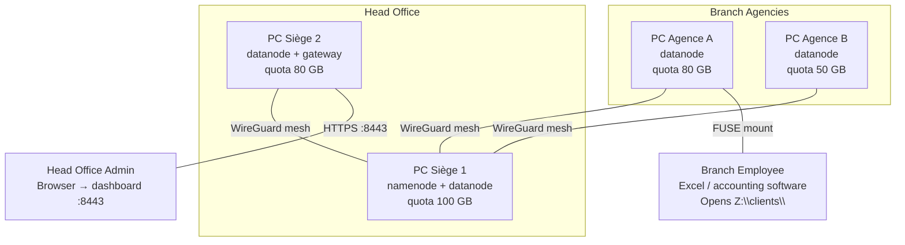

<p align="center">
  <picture>
    <source srcset="assets/wouri.webp" type="image/webp">
    
  </picture>
</p>

# WouriFS

**An auditable distributed filesystem that blends into existing workflows with minimal friction — every write leaves a cryptographically verifiable trace.**

---

## Description

WouriFS is a distributed, replicated, cryptographically-auditable filesystem built in Go, designed for Cameroonian microfinance institutions (Category 1 & 2 EMFs) that operate without dedicated IT staff or server infrastructure.

### The Problem

Small microfinance institutions in Cameroon manage their financial data in isolated silos — one per branch. Each agency maintains its own spreadsheets, local databases, or paper ledgers. There is no centralized storage, no real-time reconciliation between branches, and no technical mechanism preventing a branch manager from modifying records on their local machine without the head office ever knowing. This structural condition enabled the undetected ledger manipulation behind the collapse of FIFFA (2012) and COMECI (2016—2018).

### The Solution

WouriFS operates at the filesystem layer. Every branch workstation mounts a shared directory via FUSE. Employees save Excel spreadsheets, accounting files, and client records the way they always have. The difference: nothing is stored locally. Every file lives in a distributed cluster replicated across all branch workstations, encrypted at rest, and every write is timestamped, attributable, and cryptographically verifiable in an immutable audit log.

**The employee sees a folder. The head office sees everything in real time. The audit trail sees everything, forever.**

---

## Architecture



### Key Components

| Component | Role |
|---|---|
| **Namenode** | Metadata server — file-to-chunk mapping, namespace isolation, WAL persistence, Raft consensus (HA planned) |
| **Datanode** | Chunk storage — flat binary files, RF=3 replication, quorum writes (W≥2), AES-256-GCM encryption at rest |
| **FUSE Client** | POSIX filesystem mount — `cat`, `ls`, `mkdir` work transparently. Zero training for employees. |
| **Gateway** | Admin dashboard — cluster health, user provisioning, dual-control USB key workflow, audit inspection |
| **Audit Log** | SHA-256 Merkle-chained append-only journal. Every write recorded. Immutable. Verifiable on demand. |
| **wouri-watchd** | Anomaly detection daemon — out-of-hours writes, velocity spikes, dormant user activity, Raft leadership changes |
| **Keyring** | AES-256-GCM per-chunk encryption. Master key sealed with Shamir's Secret Sharing (k=2, n=2) — two officers required to unseal. |

### No Servers Required

Every office workstation runs `wourifs serve datanode` and contributes a configurable disk quota. One or two workstations at the head office additionally run `wourifs serve namenode`. Total cluster capacity = sum of all workstation quotas. Replication factor 3 means data survives any single machine failure.

---

## Prerequisites & Installation

### Requirements

- Linux (Ubuntu 22.04 LTS+), x86-64
- Go 1.21+
- `libfuse3-dev`
- 2+ machines on the same LAN (or Tailscale for multi-site WAN)

### Build

```bash
git clone https://github.com/MiltonJ23/WouriFS.git
cd WouriFS
sudo apt install -y golang-go libfuse3-dev
go build ./cmd/wourifs/
```

One binary. That's it.

---

## Usage

### First-Time Setup

```bash
./wourifs init
# Cluster name: emf-yaounde
# Node ID: siege-1
# Roles: namenode,datanode
# Disk quota (GB): 100
# Data directory: /var/lib/wourifs/siege-1
# Network mode: tailscale
```

Produces `/etc/wourifs/wourifs.yaml`. Copy it to every machine, change only `node.id`.

### Start the Cluster

```bash
# Head Office — namenode + datanode
./wourifs serve namenode --dev-no-auth &
./wourifs serve datanode &

# Branch Agency — datanode only
./wourifs serve datanode &
```

### Mount the Drive

```bash
sudo ./wourifs mount -n <namenode-ip>:9000 /mnt/wourifs
```

### Use It

```bash
# Branch employee — normal file operations
echo "ID,Nom,Solde" > /mnt/wourifs/agence-a/registre.csv
echo "001,Dupont,50000" >> /mnt/wourifs/agence-a/registre.csv
cat /mnt/wourifs/agence-a/registre.csv
mkdir /mnt/wourifs/agence-a/clients
ls -R /mnt/wourifs/
```

### Admin Operations

```bash
./wourifs status                      # cluster health
./wourifs provision split             # generate Shamir shares
./wourifs provision combine           # reconstruct master key
./wourifs audit log                   # view audit entries
./wourifs audit verify                # check Merkle chain integrity
curl http://localhost:9102/metrics    # Prometheus metrics
```

### CLI Reference

```
wourifs init                  First-time interactive setup
wourifs serve namenode        Start Namenode metadata server
wourifs serve datanode        Start Datanode chunk storage
wourifs mount /mnt/wourifs    Mount distributed filesystem via FUSE
wourifs status                Cluster health overview
wourifs provision split       Generate Shamir shares (k=2, n=2)
wourifs provision combine     Reconstruct master secret from shares
wourifs audit log             Query append-only audit log
wourifs audit verify          Verify Merkle chain integrity
```

---

## Contributing

This project is a Bachelor's Final Year Dissertation at The ICT University. External contributions are not accepted during the evaluation period. For academic inquiries, contact the author.

---

## License

Copyright &copy; 2026 Zingui Fred Mike. All Rights Reserved.

This software is the confidential, proprietary, and unpublished intellectual property of the author, developed as part of the BSc Computer Science Final Year Project at The ICT University. Access is granted solely to authorized academic evaluators under the terms of a written Non-Disclosure Agreement. See [LICENSE](LICENSE) for the full terms.
